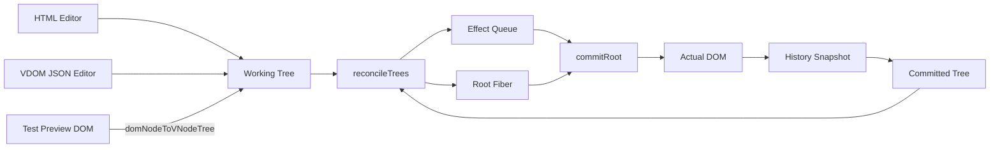
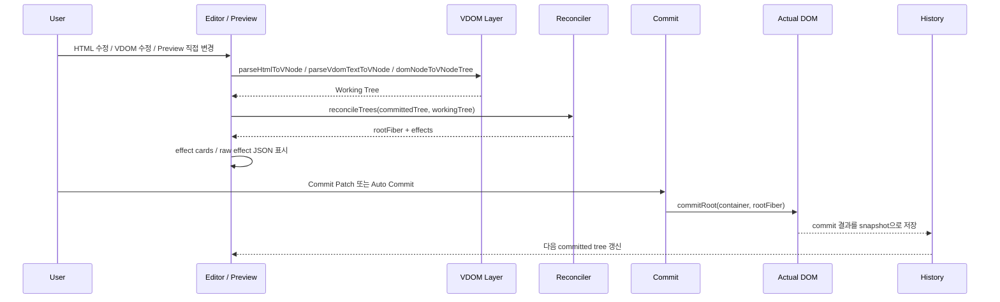
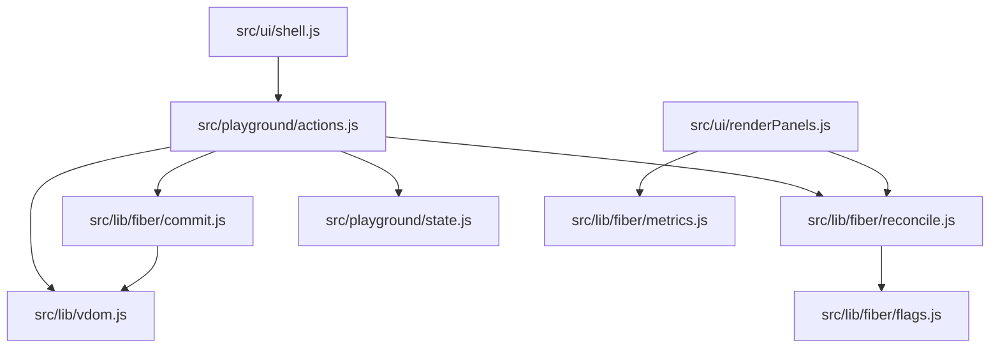

# Virtual DOM Diff Lab

`Virtual DOM Diff Lab`은 브라우저 DOM을 읽어 Virtual DOM으로 정규화하고, commit된 트리와 작업 중인 트리를 비교해 effect queue를 만든 뒤, 그 effect만 실제 DOM에 반영하는 학습용 playground입니다.

이 프로젝트는 단순히 결과 화면을 렌더링하는 데서 끝나지 않고, `parse/read -> reconcile -> effects -> commit` 흐름과 `history snapshot`, `auto commit`, `HTML/VDOM 양방향 편집`까지 한 번에 확인할 수 있도록 구성되어 있습니다.

## Architecture At A Glance



이 흐름의 핵심은 "입력 소스를 하나의 working tree로 모으고, committed tree와 비교한 뒤, effect queue만 실제 DOM에 반영한다"는 점입니다.

## Features

- HTML 문자열, 실제 브라우저 DOM, VDOM(JSON) 사이를 오가며 상태를 비교
- HTML 편집 모드와 VDOM(JSON) 편집 모드 제공
- 테스트 preview를 직접 수정하면 working tree와 editor를 다시 동기화
- `INSERT_CHILD`, `MOVE_CHILD`, `REMOVE_CHILD`, `UPDATE_PROPS`, `UPDATE_TEXT` effect 추적
- keyed diff 지원
  - `data-key` 또는 `id`가 있으면 reorder를 `MOVE_CHILD`로 처리
- manual commit과 auto commit 모두 지원
- effect 카드, raw effect JSON, 통계 카드, history snapshot 제공
- undo/redo로 이전 commit 상태 복원 가능

## How It Works

프로젝트의 흐름은 아래와 같습니다.

1. 초기 샘플 DOM을 읽어 commit 기준선이 되는 Virtual DOM 트리를 만듭니다.
2. HTML editor, VDOM editor, test preview 직접 수정 중 하나로 working tree를 바꿉니다.
3. `reconcileTrees`가 committed tree와 working tree를 비교해 `rootFiber`와 `effects`를 만듭니다.
4. UI는 pending effect queue 또는 마지막 commit 기록을 카드와 JSON으로 보여 줍니다.
5. `commitRoot`가 effect를 안전한 순서로 정렬해 실제 DOM에 반영하고, 결과를 history snapshot으로 저장합니다.

핵심은 `계산(reconcile)`과 `반영(commit)`을 분리해서, "무엇이 바뀌는지"와 "어떻게 DOM에 적용되는지"를 따로 볼 수 있다는 점입니다.



현재 diff 알고리즘은 최소 변경을 다섯 가지 effect 케이스로 나눠서 다룹니다.

- `INSERT_CHILD`
  - 새 노드를 추가해야 하는 경우
- `MOVE_CHILD`
  - 기존 노드를 재생성하지 않고 위치만 바꾸는 경우
- `REMOVE_CHILD`
  - 더 이상 필요 없는 노드를 제거하는 경우
- `UPDATE_PROPS`
  - 노드는 유지한 채 속성만 변경하는 경우
- `UPDATE_TEXT`
  - 텍스트 노드의 내용만 변경하는 경우

이 다섯 케이스는 [`reconcileTrees`](./src/lib/fiber/reconcile.js)가 이전 트리와 다음 트리를 비교하면서 계산합니다. 삭제는 `scheduleDeletion`, 속성 변경은 `markPropsUpdate`, 텍스트 변경은 `markTextUpdate`, 삽입과 이동은 `markPlacement`를 통해 effect queue에 기록됩니다.

이후 [`commitRoot`](./src/lib/fiber/commit.js)가 effect queue를 실제 DOM 연산으로 실행합니다. 내부적으로 삭제, 이동, 삽입, 속성 변경, 텍스트 변경을 각각 분기 처리하고, effect 타입별 우선순위에 따라 commit 순서도 정렬합니다.

## UI Overview

- `Actual DOM`
  - 현재 commit이 완료된 실제 DOM 상태
- `Editor + Preview`
  - HTML 또는 VDOM(JSON)을 편집하고, test preview에서 바로 결과를 확인하는 영역
- `Fiber Effects`
  - 지금 pending 상태의 effect queue 또는 마지막 commit 기록을 카드로 표시
- `Effect JSON`
  - raw effect 데이터를 그대로 확인
- `History`
  - commit snapshot을 시간순으로 저장하고 undo/redo처럼 이동
- `Stats Cards`
  - pending insert/remove/move/attr/text 개수를 요약

## Core APIs

- [`parseHtmlToVNode`](./src/lib/vdom.js)
  - HTML 문자열을 내부 Virtual DOM으로 변환
- [`parseVdomTextToVNode`](./src/lib/vdom.js)
  - JSON 문자열을 내부 Virtual DOM으로 변환
- [`domNodeToVNodeTree`](./src/lib/vdom.js)
  - 현재 브라우저 DOM을 Virtual DOM 스냅샷으로 변환
- [`reconcileTrees`](./src/lib/fiber/reconcile.js)
  - 이전/다음 트리를 비교해 effect queue와 root fiber 생성
- [`commitRoot`](./src/lib/fiber/commit.js)
  - effect queue를 실제 DOM 변경으로 반영
- [`mountVNode`](./src/lib/vdom.js)
  - Virtual DOM 전체를 실제 DOM으로 다시 마운트

## Compared With React

이 프로젝트는 React를 대체하려는 프레임워크가 아니라, React가 내부적으로 해결하는 문제를 학습하기 위한 작은 렌더링 실험 환경에 가깝습니다.

- React는 상태 관리, 컴포넌트 모델, Hook, 스케줄링, 이벤트 시스템, 생태계까지 포함한 완성도 높은 UI 라이브러리입니다.
- 이 프로젝트는 그중에서도 `Virtual DOM 비교`, `Fiber effect 기록`, `commit 과정`에 집중해 내부 동작을 눈으로 확인할 수 있게 단순화한 데모입니다.
- 즉 React가 "사용하는 도구"라면 이 프로젝트는 React의 핵심 렌더링 아이디어를 "설명하는 도구"에 가깝습니다.

## Important Edge Cases

이 playground에서 가장 중요한 엣지 케이스는 두 가지입니다.

첫째, key가 없는 리스트를 재정렬하면 index 기반 diff는 항목의 "이동"이 아니라 같은 위치의 DOM 노드를 재사용하면서 텍스트와 속성만 바꿀 수 있습니다. 그 결과 입력값, 포커스, 체크 상태 같은 로컬 DOM 상태가 다른 항목에 잘못 붙을 수 있습니다. 그래서 리스트 렌더링에서는 안정적인 `key`가 중요합니다.

둘째, form control은 직렬화된 속성과 live DOM 상태가 쉽게 어긋납니다. 현재 구현은 `input.value`, `checked`, `textarea.value`, `option.selected` 같은 현재 브라우저 상태를 우선 읽어서 working tree와 실제 DOM 스냅샷을 최대한 맞추려고 합니다. 다만 `select` 제어 규약까지 React처럼 완전히 추상화한 것은 아닙니다.

## Project Structure



- [`src/lib/vdom.js`](./src/lib/vdom.js)
  - Virtual DOM 생성, 파싱, 직렬화, DOM 변환
- [`src/lib/fiber/reconcile.js`](./src/lib/fiber/reconcile.js)
  - 트리 비교와 effect queue 생성
- [`src/lib/fiber/commit.js`](./src/lib/fiber/commit.js)
  - effect queue를 실제 DOM 연산으로 반영
- [`src/lib/fiber/flags.js`](./src/lib/fiber/flags.js)
  - Fiber flag 비트마스크 정의
- [`src/lib/fiber/metrics.js`](./src/lib/fiber/metrics.js)
  - effect 집계와 path 포맷팅
- [`src/playground/actions.js`](./src/playground/actions.js)
  - editor, preview, commit, history 상호작용
- [`src/playground/state.js`](./src/playground/state.js)
  - playground 전역 상태 생성
- [`src/ui/renderPanels.js`](./src/ui/renderPanels.js)
  - effect 카드, 통계, history UI 렌더링
- [`src/ui/shell.js`](./src/ui/shell.js)
  - 앱 셸과 DOM 참조 수집

## Run

```bash
npm install
npm run dev
```

## Test

```bash
npm test
```
